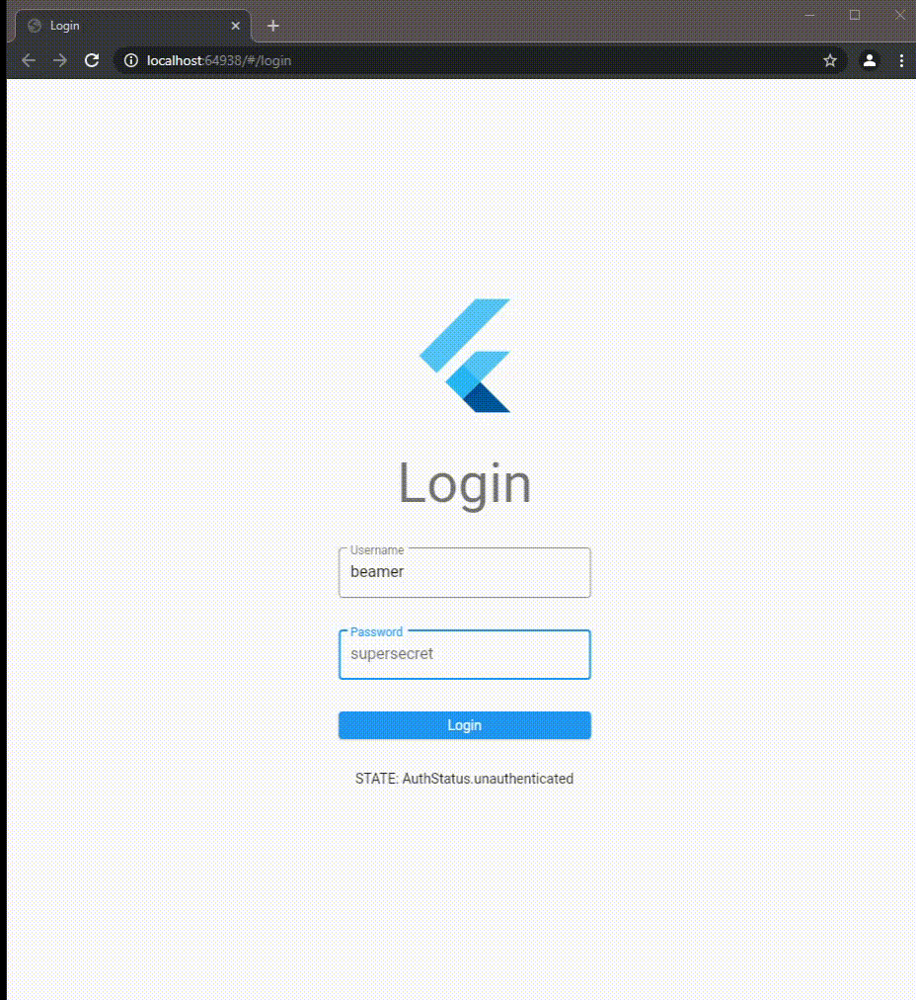

# Authentication Riverpod Example

This example shows how to use `BeamGuard`s for an authentication flow. It uses [riverpod](https://pub.dev/packages/riverpod) for state management, and [flutter_hooks](https://pub.dev/packages/flutter_hooks) which is commonly used with riverpod, it removes a lot of boilerplate code when accessing providers.

Riverpod is a rewrite of `Provider`, and makes it really easy to manage and access providers.

Run `flutter create .` to generate all necessary files, if needed.
